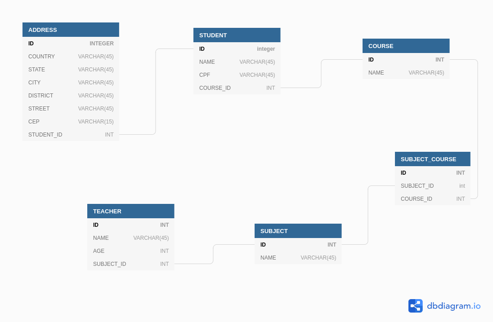

# College API

<h3 align="center">
  
<h3>

####

API lida com professores, alunos, cursos e disciplinas.

## Tecnologias utilizadas

- **[Express](http://expressjs.com/)**
- **[Postgres](https://www.postgresql.org/)**
- **[Knex](http://knexjs.org/)**

### Executando a api

Para executar a api é necessário ter instalado no computador:

- Git
- Insomnia
- PostgresSQL
- yarn ou npm

```
# Fazendo clone do repositório
git clone git@github.com:abelsouzacosta/college.git

# Entrar no repositório
cd college/

# Instalar as dependências
yarn or npm install
```

Foi usado o _dotenv_ para lidar com as variáveis de ambiente, por isso **_renomeie o arquivo .env.example para .env_**. Dentro desse arquivo devem ser definidas as seguintes variáveis:

```
# Porta da aplicação
PORT =

# Nome do Banco de Dados
DB_NAME =

# Username do banco de dados
DB_USERNAME =

# Senha do Banco de Dados
DB_PASSWORD =
```

Definidas as variáveis é preciso executar as _migrations_ do banco de dados:

```
# Executando as migrations
yarn knex migrate

# Executar os seeders (opcional)
yarn knex seed
```

O banco de dados está disposto da seguinte forma:

<h3 align="center">
  
<h3>

### Ambiente de testes

Para baixar o ambiente do Insomnia dessa api use o botão abaixo:

[](https://insomnia.rest/run/?label=College&uri=https%3A%2F%2Fraw.githubusercontent.com%2Fabelsouzacosta%2Flibrary-content%2Fmaster%2Fcollege_api.json%3Ftoken%3DAHJQ6XDCVRAFTSDM4BKEQWDALQOQ2)
